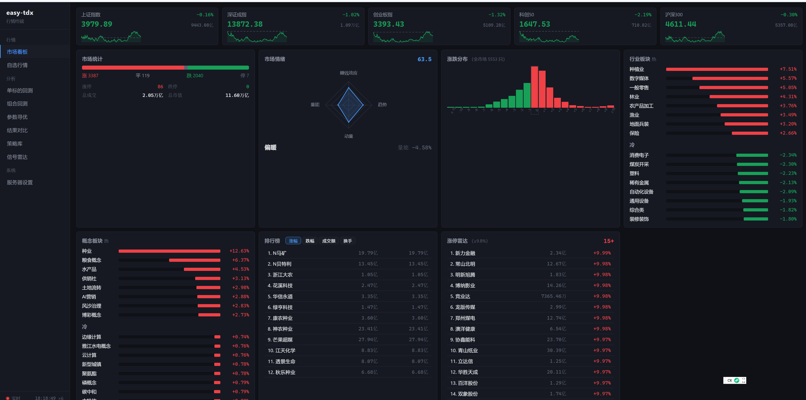
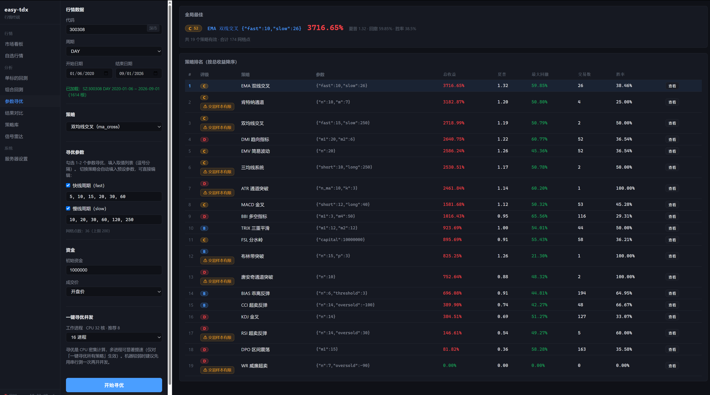
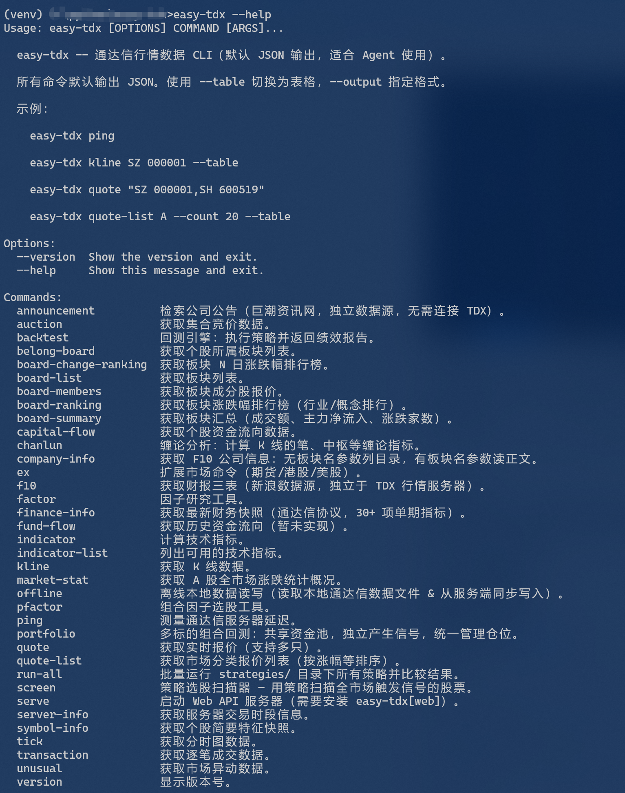
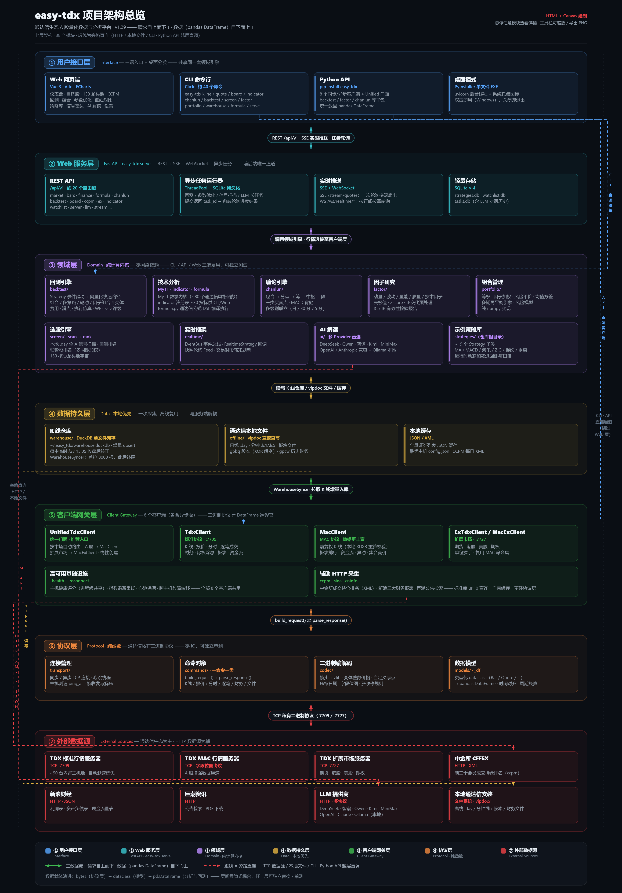

# easy-tdx

[](LICENSE)
[](https://pypi.org/project/easy-tdx/)
[](https://github.com/handsomejustin/easy-tdx)
[](https://github.com/handsomejustin/easy-tdx)
[](http://www.mypy-lang.org/)
[](https://deepwiki.com/handsomejustin/easy_tdx)


## Star History

<a href="https://www.star-history.com/?repos=handsomejustin%2Feasy_tdx&type=timeline&legend=bottom-right">
 <picture>
   <source media="(prefers-color-scheme: dark)" srcset="https://api.star-history.com/chart?repos=handsomejustin/easy_tdx&type=timeline&theme=dark&legend=top-left" />
   <source media="(prefers-color-scheme: light)" srcset="https://api.star-history.com/chart?repos=handsomejustin/easy_tdx&type=timeline&legend=top-left" />
   
 </picture>
</a>

量化基金花百万买的毫秒级行情通道，散户连一根日线都要手动截图——这不是技术差距，这是数据霸凌。

easy-tdx 要做的事很简单：**把机构的数据锁砸开，扔到每个普通人桌面。**

它是一个完全免费、无需注册、无需 API Key、纯开源的 A 股量化工具箱。对通达信网络协议净室实现（不依赖通达信客户端，也能直接读写本地数据文件），一行命令即可拉取 K 线、报价、板块、资金流、分时、逐笔成交；Python API / CLI / Web API 三通道，输出 JSON 天然喂给 AI Agent。

## 四大能力

### 🖥️ 行情终端（Web UI）

`easy-tdx serve` 一条命令，浏览器秒变专业看盘终端，全部板块级数据由协议直连、不花一分钱：

- **市场看板**：五大指数实时推送（SSE）、全市场涨跌统计、四维情绪雷达、涨停雷达、两市异动雷达、全市场涨跌分布
- **行业总览 / 概念总览**：全部板块一屏尽览（一级行业/二级行业/概念），热力图 + 表格双视图、板块广度统计与涨跌幅分布、涨幅/跌幅/涨速异动三榜、翻红/翻绿轮动时间线，点击板块下钻分时/日K + 成分股涨跌榜
- **自选行情**：全表 SSE 实时刷新、行内迷你分时；**龙头池**：159 只核心龙头一键扫描
- **期货持仓排名**：中金所每日成交/持仓前 20 名会员一键采集（含新手科普）

  

- **个股详情弹窗**：五档盘口 + 1/3/5 日分时 + 带 MA/BOLL/MACD/KDJ/RSI 的日 K，一键加自选、一键全策略寻优



<p align="center">
  <br>
  <sub>行业总览（一级行业 128 个板块）：热力图红涨绿跌、顶部板块广度统计 + 涨跌幅分布直方图，右栏涨幅 / 跌幅 / 异动涨速 Top10 与翻红翻绿时间线</sub>
</p>

| 行业总览 · 按 20 日涨幅排序（多周期轮动一览） | 概念总览 · 269 个概念板块（支持搜索过滤） |
|:---:|:---:|
|  <br><sub>切 3日/5日/20日/YTD 排序，哪些行业在走中期趋势一眼可见</sub> |  <br><sub>按名称/代码实时过滤，单击板块下钻分时/日K + 成分股涨跌榜</sub> |

### 📊 回测工作台（Web UI + 回测引擎）

浏览器里选标的、挑策略、调参数，全程零代码；也可以走 CLI / Python API：

- **回测引擎**：内置 54 个策略（覆盖全部 50 个注册指标），`init()/next()` 两函数写自定义策略，订单撮合/费率/滑点/移动止损齐备，引擎行为由黄金测试锁定
- **防过拟合验证链**：Walk-Forward 样本外验证（逐窗独立开仓）、训练/验证/测试三段适配性体检、0-100 综合评分、多 seed 晋级门槛、买入持有基准对比（α/β/信息比率/跟踪误差）
- **25 项绩效指标 + S/A/B/C/D 评级**：SQN、Ulcer、95% VaR/CVaR、最大连胜/连亏……评级不看收益率，只看风险调整后的持有体验
- **组合与寻优**：多标的组合回测、多策略资金分仓、参数网格寻优（单策略/一键全策略）、策略库 SQLite 持久化、策略选股全市场扫描
- **通达信公式**：不会 Python 也能玩——粘贴公式（`买入: CROSS(MA(C,5), MA(C,20));`）即可计算/选股/回测，30+ 函数白名单向量化求值，无未来数据
- **AI 解读**：配置你自己的模型（DeepSeek / 通义千问 / 智谱 GLM / Kimi / OpenAI / Claude / Ollama 本地免 Key 等 9 家 Provider），一键把整份回测报告变成「老手朋友」口吻的大白话 + 改进建议 + 信心分；解读历史自动归档、一键复现



勾选「附加分析」，回测报告自动附带**防过拟合验证链**（下图为布林带突破策略在 SH601088 六年半日线上的实拍）：

<p align="center">
  <br>
  <sub>单标的回测：K 线买卖点 + 净值曲线与回撤；左侧勾选「附加分析」— Walk-Forward 样本外验证（窗口数可调）与一条龙评估随回测自动运行</sub>
</p>

<p align="center">
  <br>
  <sub>S/A/B/C/D 评级（卡玛/利润因子/回撤/胜率/夏普/波动率六维权重条）+ Walk-Forward 逐窗收益柱状图：盈利窗占比 7/8、每窗独立开仓——「回测好」升级为「样本外也好」</sub>
</p>

| 一条龙评估：综合分 + 高适配 + 基准对比 + 25 项绩效 | 成交记录明细 |
|:---:|:---:|
|  <br><sub>综合分 86.2/100 · 高适配徽标 · α/β/信息比率/跟踪误差 · 60/20/20 三段适配性体检 8/8 通过；25 项指标含 Ulcer / VaR / CVaR / SQN / 最大连胜连亏</sub> |  <br><sub>逐笔买卖的价格 / 手数 / 盈亏全列出，可直接跟单复盘</sub> |

### 🔬 数据与指标

- **34 个技术指标**：MACD/KDJ/RSI/BOLL/DMI/ATR 到捉妖大师（ZHUOYAO）、30 日乖离率信号（BIAS_SIGNAL），支持自定义参数与分钟线
- **缠论分析**：K线合并 → 分型 → 笔 → 中枢 → 线段 → 买卖点 → 背驰，一键出结果，支持多级别联立
- **因子与组合**：19 个内置因子、IC/分层/衰减分析、4 种组合优化器 + 再平衡引擎、TWAP/VWAP 执行仿真与方根冲击滑点
- **数据底座**：本地 K 线仓库（DuckDB 增量同步 + 临时 bar 状态机 + 健康自检）、通达信本地文件离线读写、财报三表 / 通达信 F10 / 巨潮公告 / 新浪财经

### 🤖 AI Agent 友好

所有 CLI 默认输出 JSON（`--table` 切表格）；`easy-tdx serve` 一键起 REST + WebSocket 服务，浏览器打开 `/docs` 就是交互式 API 文档——Claude Code、OpenClaw 等 Agent 直接吃。



## 30 秒上手

```bash
pip install easy-tdx
easy-tdx ping                                   # 服务器测速
easy-tdx kline SH 600519 --count 10 --table     # K 线
easy-tdx serve                                  # 行情终端 + 回测工作台（浏览器自动打开）
```

**你不懂 TCP 协议？不用。**
**你不会写量化框架？不用。**
**你想回测验证策略？自带引擎，不用。**
**你不想给任何平台付一分钱？完全不用。**

`pip install easy-tdx`，30秒后——你屏幕上的数据，和机构看到的**是同一份**。

📖 **文档**：[GitHub Wiki](https://github.com/handsomejustin/easy_tdx/wiki)（各模块指南） ·
[回测系统完全上手手册](./docs/回测系统完全上手手册.html)（零基础图文，13 章） ·
[docs/](./docs) 目录（策略开发手册 / 量化指南 / API 字段参考）

---

**为什么做这个？**

金融数据的获取门槛，从来不该是散户亏钱的理由。  
当量化基金用程序化交易像割草一样收割市场时，普通人至少应该**有权利拿一样的武器**。

这不是一个帮你“赚钱”的工具。  
这是让你**不再裸奔**的工具。

**MIT 协议，代码全开源。**  
随便用，随便改，随便分发。  
**数据面前，人人平等。**


## 项目架构



七层分层，请求自上而下、数据（pandas DataFrame）自下而上：**用户接口层**（Web UI / CLI / Python API / 桌面 EXE）→ **Web 服务层**（FastAPI + SSE 实时推送 + 异步任务）→ **领域层**（回测 / 指标 / 缠论 / 因子 / 选股 / 组合，纯计算零网络）→ **数据持久层**（DuckDB K 线仓库 + 通达信本地 vipdoc 文件）→ **客户端网关层**（8 个客户端 + 健康分 / 故障转移）→ **协议层**（通达信二进制协议编解码）→ **外部数据源**（通达信服务器 / 中金所 / 新浪 / 巨潮 / LLM）。

🖼️ 交互版架构图（38 模块职责详情）+ 源码树 + 分层要点：[docs/architecture.md](./docs/architecture.md) · [architecture.html](./docs/architecture.html)

## 安装

```bash
pip install easy-tdx                # 自动注册 easy-tdx CLI 命令
pip install -e ".[dev]"             # 开发模式（测试 / 静态检查工具链）
pip install -e ".[web]"             # Web API 模式（FastAPI + Uvicorn）
```

可选依赖分组：`warehouse`（DuckDB 本地 K 线仓库）、`baostock`（通达信全部路径失败时的最后一级兜底数据源，仅日/周/月线，`EASY_TDX_BAOSTOCK=0` 可关闭）、`packaging`（PyInstaller 打包 EXE）。开发环境初始化（uv）与完整开发流程见 [docs/development.md](./docs/development.md)。

## Web UI 零代码使用

`easy-tdx serve` 一条命令启动行情终端 + 回测工作台，浏览器自动打开 `http://localhost:8000`；不想装 Python 可下载 Windows 单文件 EXE 双击使用。页面操作手册见 [docs/web-ui.md](./docs/web-ui.md)。

## 文档导航

**快速入口**：[GitHub Wiki](https://github.com/handsomejustin/easy_tdx/wiki) · [回测系统完全上手手册](./docs/回测系统完全上手手册.html)（零基础图文，13 章）· [交互式架构图](./docs/architecture.html)

| 域 | 文档 | 说明 |
|----|------|------|
| CLI | [cli.md](./docs/cli.md) | 全部命令速查表 + 按域导航 |
| CLI | [cli-market.md](./docs/cli-market.md) | 报价 / K线 / 分时 / 板块 / 资金 / 中金所 / 扩展市场 |
| CLI | [cli-finance.md](./docs/cli-finance.md) | 巨潮公告检索 / 财报三表 / 通达信 F10 |
| CLI | [cli-indicators.md](./docs/cli-indicators.md) | 34 个技术指标 / 通达信公式 / 捉妖 / 乖离率 |
| CLI | [cli-backtest.md](./docs/cli-backtest.md) | backtest / optimize / portfolio / run-all |
| CLI | [cli-screen.md](./docs/cli-screen.md) | 全市场选股扫描 / 强势股排名 |
| 教程 | [chanlun.md](./docs/chanlun.md) | 缠论分析（CLI + Python） |
| 教程 | [data-local.md](./docs/data-local.md) | 本地数据：DuckDB 仓库 / vipdoc 离线读写 |
| Web | [web-api.md](./docs/web-api.md) | REST + WebSocket + SSE 端点与示例 |
| Web | [web-ui.md](./docs/web-ui.md) | 行情终端与回测工作台操作手册 |
| Web | [packaging.md](./docs/packaging.md) | Windows EXE 打包与分发 |
| Python | [python-api.md](./docs/python-api.md) | 教程：连接 / 行情 / 指标 / 缠论 / 公告 / 财报 / 实时轮询 |
| Python | [api_reference.md](./docs/api_reference.md) | 参考：客户端方法速查 |
| Python | [field_mapping.md](./docs/field_mapping.md) | 参考：数据模型与枚举字段对照 |
| 回测 | [backtest_usage.md](./docs/backtest_usage.md) | 引擎使用手册（策略 / 配置 / 结果） |
| 回测 | [backtest-examples.md](./docs/backtest-examples.md) | 完整示例集 + 注意事项 |
| 量化 | [quantitative-guide.md](./docs/quantitative-guide.md) | 因子引擎与组合管理 |
| 量化 | [quantitative-advanced.md](./docs/quantitative-advanced.md) | 滑点 / 执行仿真 / 归因 / 完整工作流 |
| 指标 | [indicator-zhuoyao.md](./docs/indicator-zhuoyao.md) | 捉妖大师信号详解 |
| 指标 | [indicator-bias-signal.md](./docs/indicator-bias-signal.md) | 30 日乖离率信号详解 |
| 开发者 | [architecture.md](./docs/architecture.md) | 七层架构 / 源码树 / 分层要点 |
| 开发者 | [development.md](./docs/development.md) | 环境 / 测试 / CI / 发布流程 / 文档规范 |
| 协议 | [protocol-reverse-engineering.md](./docs/protocol-reverse-engineering.md) | 通达信协议逆向过程 |
| 协议 | [protocol-unknown-fields.md](./docs/protocol-unknown-fields.md) | 未知字段研究日志（活文档） |

> 📦 历史归档（均已实施/规划完成，供追溯）：board-overview-design、hotspot-rolling-design、market-insights-roadmap、upgrade-plan-2026H2（见 docs/ 目录）与 docs/superpowers/（计划存档）。
>
> 完整文档索引（分类目录 + 归档标注）见 [docs/index.md](./docs/index.md)。

## 致谢

- [pytdx](https://github.com/rainx/pytdx) -- 离线数据读取模块借鉴自 pytdx 项目，感谢 rainx 及所有贡献者
- [xmtdx](https://github.com/minionszyw/xmtdx) -- 本项目初始原型
- [mootdx](https://github.com/mootdx/mootdx) -- 工程化封装参考
- [MyTT](https://github.com/mpquant/MyTT) -- 麦语言技术指标算法库，技术指标计算基于此实现

详见 [NOTICE](NOTICE) 和 [LICENSE](LICENSE)。

## 更新日志

完整版本变更记录请查看 [CHANGELOG.md](CHANGELOG.md)。

## 免责声明

本工具仅供学习和技术研究使用，不构成任何投资建议。使用者应自行承担投资决策的全部风险。
作者不对因使用本工具导致的任何直接或间接损失负责。
