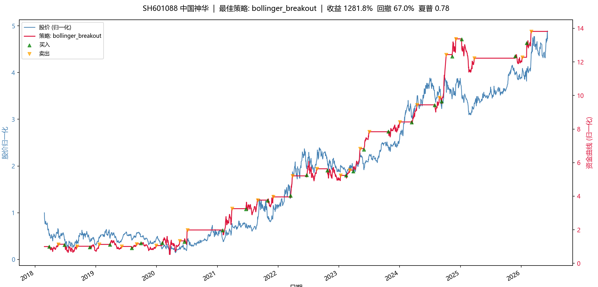
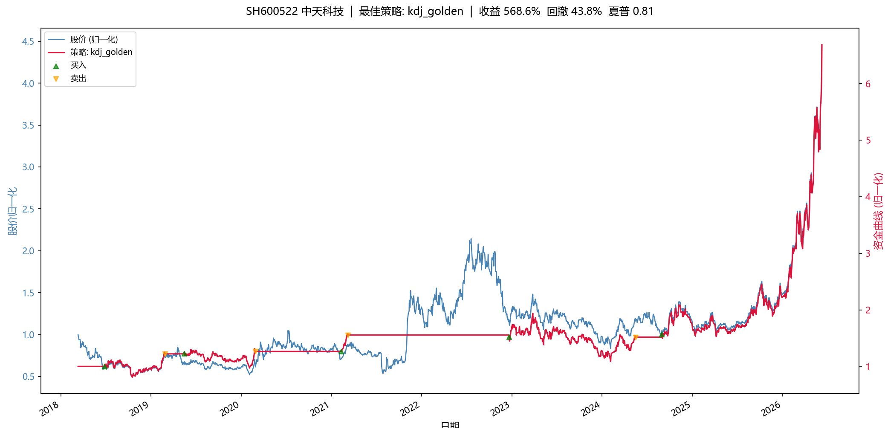
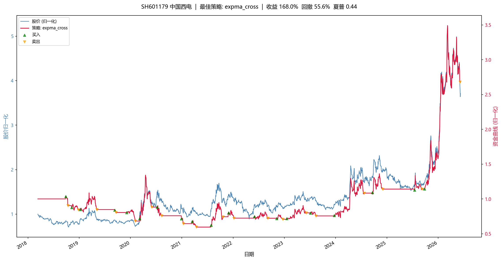
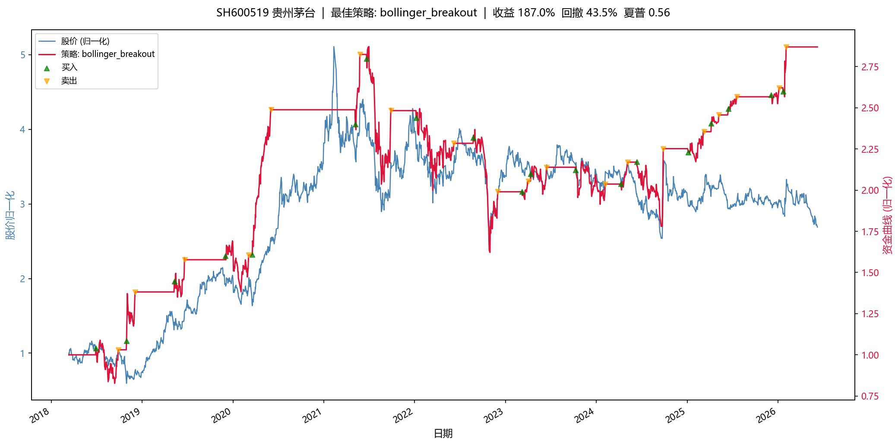

# CLI 参考 — 回测与寻优

## 回测引擎

> 📖 **完整使用手册**：[backtest_usage.md](./backtest_usage.md) ——
> 涵盖策略编写（`init()`/`next()`）、行情数据访问、指标注册、订单模拟、
> 绩效指标、组合回测、调仓引擎与完整示例。回测相关用法以该手册为准。

内置向量回测引擎，加载 Python 策略文件即可跑回测。策略继承 `Strategy` 基类，在 `init()` 注册指标，在 `next()` 逐 bar 生成买卖信号，引擎完成订单模拟、持仓跟踪和绩效分析。

**单策略回测：**

```bash
easy-tdx backtest SZ 300308 --strategy-file strategies/expma_cross.py --count 2000 --cash 1000000 --adjust QFQ --table
# 推荐加上 --slippage 0.01 模拟真实滑点（元/股），使回测更贴近实盘

# 缠论自动桥接：引擎自动计算缠论分析并注入策略 self.chanlun
easy-tdx backtest SZ 000001 --strategy-file strategies/chanlun_strategy.py --chanlun-level DAILY --table

# 预计算指标（MACD, KDJ 会作为额外列注入 DataFrame）
easy-tdx backtest SZ 000001 \
    --strategy-file strategies/macd_strategy.py \
    --indicators MACD,KDJ
```

`backtest` 命令 CLI 参数：

| 参数 | 默认值 | 说明 |
|------|--------|------|
| `MARKET` | — | 市场代码：SZ / SH |
| `CODE` | — | 股票代码：如 000001 |
| `--strategy-file` | — | Python 策略文件路径 |
| `--cash` | 100000 | 初始资金 |
| `--commission` | 0.0003 | 佣金率 |
| `--execution` | next_open | 成交价规则 |
| `--period` | DAILY | K 线周期 |
| `--adjust` | NONE | 复权方式：NONE / QFQ / HFQ |
| `--count` | 500 | K 线数量 |
| `--indicators` | — | 预计算指标（逗号分隔） |
| `--table` | False | 表格输出 |
| `--output` | json | 输出格式：json / table / csv |
| `--wf` | False | 附加 Walk-Forward 样本外验证 |
| `--wf-windows` | 7 | Walk-Forward 窗口数 |
| `--evaluate` | False | 一条龙评估（回测+WF+适配性+评分+评级+基准对比） |
| `--auto-fees` | False | 按标的品种自动解析费率 |

**样本外验证（v1.25）：**

```bash
# 附加 Walk-Forward 七窗样本外验证（每窗独立开仓，窗口数可调）
easy-tdx backtest SZ 300308 --strategy-file strategies/expma_cross.py --wf --wf-windows 7

# 一条龙评估：回测 + WF + 适配性体检 + 综合评分 + S-D 评级 + 买入持有基准对比
easy-tdx backtest SZ 300308 --strategy-file strategies/expma_cross.py --evaluate
```

输出示例：

```
=== 回测绩效概要 ===
总收益率: 1413.51%
年化收益: 40.85%
最大回撤: 76.75%
夏普比率: 0.88
胜率: 20.8%
交易次数: 24
```

> ⚠️ **回测 ≠ 实盘**。以上收益率为历史数据回测结果，包含幸存者偏差和过拟合风险，
> 不构成投资建议。实际交易需考虑滑点、流动性、涨跌停无法成交等因素。
> 请在充分理解策略逻辑后谨慎使用。

**参数网格寻优（optimize）与内置策略列表（strategies）：**

```bash
# 列出全部内置策略（名称/参数默认值/预设寻优网格）
easy-tdx strategies

# 单策略网格寻优（预设网格或 --param 自定义，--workers 4 进程并行）
easy-tdx optimize SZ 000001 --strategy ma_cross
easy-tdx optimize SZ 000001 --strategy ma_cross --param fast=5,10,15 --param slow=20,60

# 一键寻优所有内置策略：逐策略按预设网格寻优后全局排名（对应 Web UI /optimize 页）
easy-tdx optimize SZ 000001 --all --workers 4 --table

# strategies 也支持 JSON 输出（含完整参数 schema，与 Web API GET /backtest/strategies 同构）
easy-tdx strategies --output json
```

`optimize` 参数：

| 参数 | 默认值 | 说明 |
|------|--------|------|
| `--strategy` | — | 注册表策略名（与 `--all` 二选一） |
| `--all` | False | 一键寻优所有内置策略（STRATEGY_PRESETS 预设网格） |
| `--param` | 预设网格 | 自定义参数网格，如 `fast=5,10,15`（最多 2 个参数，笛卡尔积 ≤ 200） |
| `--cash` | 1000000 | 初始资金 |
| `--commission` | 0.0003 | 佣金率 |
| `--slippage` | 0.0 | 滑点 |
| `--workers` | 1 | 并行进程数（2+ 进程级并行；1 = 串行 + 指标缓存复用） |
| `--top` | 15 | 表格输出显示前 N 行 |

Python API 同名能力：`easy_tdx.backtest.optimizer.ParamGridOptimizer`（单策略）与
`easy_tdx.backtest.optimizer.optimize_all_strategies`（一键全策略）。

**全策略批量对比（CLI）：**

`easy-tdx run-all` 一行命令跑完 `strategies/` 下所有策略并排名：

```bash
easy-tdx run-all SZ 300308 --count 2000 --cash 1000000 --adjust QFQ

# 多因子组合回测
easy-tdx run-all SZ 300308 --combo 2 --combo-mode MAJORITY

# 加 --show 自动弹出最佳策略的资金曲线 vs 股价对比图
easy-tdx run-all SZ 300308 --count 2000 --cash 1000000 --adjust QFQ --show

# 自定义策略目录
easy-tdx run-all SZ 300308 --strategies-dir my_strategies/
```

也可使用项目自带的 `run_all_strategies.py` 脚本（功能相同）：

```bash
python -X utf8 run_all_strategies.py SZ 300308 --count 2000 --cash 1000000 --adjust QFQ

# 加 --show 自动弹出最佳策略的资金曲线 vs 股价对比图
python -X utf8 run_all_strategies.py SZ 300308 --count 2000 --cash 1000000 --adjust QFQ --show
```

**多因子组合回测：**

自动遍历所有 2 因子 / 3 因子组合，找到最优搭配：

```bash
# 自动寻找最佳 2 因子和 3 因子组合（MAJORITY 模式）
python -X utf8 run_all_strategies.py SZ 300308 --combo 2 --combo 3 --combo-mode majority

# CLI 方式
easy-tdx run-all SZ 300308 --combo 2 --combo 3 --combo-mode majority
```

CLI 指定策略文件组合：

```bash
easy-tdx backtest SZ 000001 \
  --combo-strategies strategies/macd_cross.py,strategies/rsi_reversal.py,strategies/bollinger_breakout.py \
  --combo-mode majority --table
```

Python API：

```python
from easy_tdx.backtest import CombinationRunner

runner = CombinationRunner(
    strategy_classes=[MACDStrategy, RSIStrategy, BollingerStrategy],
    df=df, cash=100000,
)
results = runner.screen(combo_sizes=(2, 3), mode="MAJORITY")
for r in results[:5]:
    print(f"{r.name}: 收益={r.result.performance['total_return']:.2%}")
```

信号合并模式：

| 模式 | 买入条件 | 卖出条件 | 特点 |
|------|---------|---------|------|
| `AND` | 所有因子都看多 | 所有因子都看空 | 极保守，交易少但精确 |
| `MAJORITY` | 过半因子看多 | 过半因子看空 | 平衡，推荐默认 |
| `OR` | 任一因子看多 | 任一因子看空 | 激进，信号多噪声大 |

`--show` 会用 matplotlib 弹出一个双轴对比窗口：左轴蓝色线是归一化股价，右轴红色线是最佳策略的资金曲线，绿三角=买入、黄三角=卖出，标题显示股票名称和关键绩效指标。需要 `pip install matplotlib`。

**多标的组合回测（portfolio）：**

`easy-tdx portfolio` 对多只股票同时回测，共享资金池，按均等比例分配，汇总组合整体绩效：

```bash
# 两只股票组合回测
easy-tdx portfolio --stocks SZ:000001,SH:600519 --strategy-file strategies/ma_cross.py --table

# 自定义资金和周期
easy-tdx portfolio --stocks SZ:000001,SH:600519,SH:600036 \
  --strategy-file strategies/expma_cross.py --cash 500000 --period DAILY --count 1000 --table

# 搭配缠论桥接
easy-tdx portfolio --stocks SZ:000001,SH:600519 \
  --strategy-file strategies/chanlun_strategy.py --chanlun-level DAILY --table

# 组合级 Walk-Forward / 一条龙评估（与 Web UI /portfolio 页同构）
easy-tdx portfolio --stocks SZ:000001,SH:600519 \
  --strategy-file strategies/ma_cross.py --wf --wf-windows 7
easy-tdx portfolio --stocks SZ:000001,SH:600519 \
  --strategy-file strategies/ma_cross.py --evaluate
```

输出示例：

```
=== 组合回测绩效概要 ===
标的数量: 3
总资金: 200,000
组合收益率: 28.50%
组合年化: 28.50%

── 各标的详情 ──
  SZ000001: 收益=35.20% 夏普=0.92 回撤=15.30% 分配=33% 交易=12
  SH600519: 收益=18.40% 夏普=0.68 回撤=8.50%  分配=33% 交易=8
  SH600036: 收益=31.90% 夏普=0.85 回撤=12.10% 分配=33% 交易=15
```

| 参数 | 说明 |
|------|------|
| `--stocks` | 股票列表：逗号分隔的 `市场:代码`（如 `SZ:000001,SH:600519`） |
| `--cash` | 总资金（默认 20 万） |
| `--allocation` | 资金分配方式（目前支持 `equal` 均等分配） |
| `--chanlun-level` | 自动计算缠论分析并注入策略（如 DAILY/30MIN） |


## 批量运行全部策略（run-all）


```
发现 9 个策略文件
标的: SZ 300308 | K线: 2000 | 资金: 1,000,000 | 复权: QFQ
================================================================================

>> 运行策略: bias_reversal ... 完成 (2.4s)
>> 运行策略: bollinger_breakout ... 完成 (0.6s)
>> 运行策略: expma_cross ... 完成 (0.6s)
>> 运行策略: kdj_golden ... 完成 (0.1s)
>> 运行策略: ma_cross ... 完成 (1.4s)
>> 运行策略: macd_cross ... 完成 (2.1s)
>> 运行策略: rsi_reversal ... 完成 (0.2s)
>> 运行策略: turtle_breakout ... 完成 (0.1s)
>> 运行策略: volume_price ... 完成 (6.3s)

================================================================================
[*] 策略绩效排名 (按总收益率降序)
================================================================================
  排名  策略                           总收益率       年化收益       最大回撤       夏普       胜率     交易次数      盈亏比
----------------------------------------------------------------------------------------------------
 *1* 1  expma_cross             1413.51%    40.85%    76.75%     0.88   20.8%       24     6.45
 *2* 2  ma_cross                1258.07%    38.94%    58.01%     0.87   38.2%       55     2.21
 *3* 3  turtle_breakout          905.07%    33.76%    48.30%     0.83   75.0%        4    10.14
     4  bias_reversal            504.94%    25.47%    42.25%     0.70   66.3%       95     2.08
     5  macd_cross               387.67%    22.11%    61.08%     0.60   40.0%       85     2.20
     6  volume_price             247.72%    17.01%    65.73%     0.50   43.3%      254     1.40
     7  bollinger_breakout       169.65%    13.32%    49.71%     0.44   66.7%       24     1.93
     8  rsi_reversal              95.89%     8.85%    56.51%     0.33   57.1%        7     2.48
     9  kdj_golden                89.10%     8.36%    61.86%     0.32   66.7%        3    10.49
```

综合评分（夏普 × 0.4 + 收益/回撤 × 0.3 + 胜率 × 0.3）：

```
 *1* 1  turtle_breakout             23.04     0.83       0.70   75.0%
 *2* 2  bias_reversal               20.35     0.70       0.60   66.3%
 *3* 3  bollinger_breakout          20.26     0.44       0.27   66.7%
```

换一个标的再跑：

```bash
# 贵州茅台
python -X utf8 run_all_strategies.py SH 600519 --count 2000 --cash 1000000 --adjust QFQ
```

### `--show` 可视化效果

<p align="center">
  <br>
  <sub>SH601088 中国神华 — bollinger_breakout 策略 | 收益 1281.8%</sub>
</p>

<p align="center">
  <br>
  <sub>SH600522 中天科技 — kdj_golden 策略 | 收益 568.6%</sub>
</p>

<p align="center">
  <br>
  <sub>SH601179 中国西电 — expma_cross 策略 | 收益 168.0%</sub>
</p>

<p align="center">
  <br>
  <sub>SH600519 贵州茅台 — bollinger_breakout 策略 | 收益 187.0%</sub>
</p>

> **⚠️ Demo 展示，不作为操作依据。** 历史回测收益不代表未来表现，策略参数未经过样本外验证。

### 自带策略示例

`strategies/` 目录下有 16 个开箱即用的策略文件，可直接用于 `--strategy-file`：

| 文件 | 策略 | 类型 | 适合行情 |
|------|------|------|----------|
| `ma_cross.py` | 双均线交叉（MA5/MA20） | 趋势跟踪 | 单边趋势 |
| `expma_cross.py` | EMA12/EMA50 交叉 | 趋势跟踪 | 单边趋势（比 MA 更灵敏） |
| `macd_cross.py` | MACD 金叉死叉 | 趋势跟踪 | 中长线趋势 |
| `bollinger_breakout.py` | 布林带突破 | 震荡反转 | 横盘震荡 |
| `rsi_reversal.py` | RSI 超买超卖 | 反转 | 震荡市 |
| `kdj_golden.py` | KDJ 低位金叉/高位死叉 | 反转 | 短线震荡 |
| `turtle_breakout.py` | 海龟交易法（唐安奇通道） | 趋势突破 | 牛市启动 |
| `bias_reversal.py` | 乖离率反转 | 反转 | 震荡回归 |
| `volume_price.py` | 量价配合 | 综合判断 | 放量突破 |
| `zhuoyao_momentum.py` | 捉妖大师多周期共振 | 趋势跟踪 | 多周期共振强势股 |
| `dmi_trend.py` | DMI/ADX 趋势强度跟踪 | 趋势跟踪 | 单边趋势（过滤震荡） |
| `cci_breakout.py` | CCI ±100 区间突破 | 区间突破 | 震荡转趋势 |
| `mfi_volume.py` | MFI 量价反转 | 量价反转 | 震荡市（带量能确认） |
| `trix_cross.py` | TRIX 三重平滑趋势交叉 | 趋势跟踪 | 中长线（抗噪音） |
| `mtm_momentum.py` | MTM 动量零线穿越 | 动量 | 趋势拐点 |
| `obv_trend.py` | OBV 能量潮趋势 | 量价趋势 | 资金持续流入的上升趋势 |

编写自定义策略只需继承 `Strategy` 基类：

```python
from easy_tdx.backtest import Strategy
from easy_tdx import MyTT


class MyStrategy(Strategy):
    def init(self):
        self.ma = self.I(MyTT.MA, self.data.close, 10)

    def next(self):
        if self.data.close[0] > self.ma[self._bar_index]:
            self.buy(size=0)     # size=0 表示全仓
        elif self.position["size"] > 0:
            self.sell(size=0)    # size=0 表示清仓
```

完整 API 参考：[backtest_usage.md](./backtest_usage.md)
## 量化因子与组合管理

新增三大模块：**因子引擎**（19 个内置因子 + 自定义扩展）、**因子分析**（IC/分层/衰减）、**组合管理**（4 种优化器 + 再平衡引擎）。加上**高级回测增强**：可插拔滑点模型（方根冲击/成交量比例）、执行仿真（TWAP/VWAP/限价单）、归因分析（Brinson + 因子归因）。

```python
from easy_tdx.factor import FactorEngine, FactorAnalyzer, preprocess
from easy_tdx.portfolio import RebalanceEngine, FactorWeightedOptimizer
from easy_tdx.backtest import BacktestEngine
from easy_tdx.backtest.slippage import SquareRootSlippage
from easy_tdx.backtest.execution import TWAPExecution

# 因子研究
engine = FactorEngine()
factor_data = engine.compute_cross_section(data, ["momentum_20d", "rsi_14"])
clean = preprocess(factor_data, ["momentum_20d", "rsi_14"])
forward_returns = engine.compute_forward_returns(data, period=5)
report = FactorAnalyzer(clean, forward_returns).full_report("momentum_20d")
print(f"IC均值={report.mean_ic:.4f} ICIR={report.icir:.4f}")

# 组合回测
result = RebalanceEngine(
    FactorWeightedOptimizer(), factor_name="momentum_20d", n_stocks=50, cash=1_000_000,
).run(data, start_date=20230101, end_date=20240101)
print(f"年化={result.performance['annual_return']:.2%}")

# 高级回测（滑点 + 执行仿真）
engine = BacktestEngine(
    MyStrategy, cash=1_000_000,
    slippage_model=SquareRootSlippage(impact_coeff=0.1),
    execution_model=TWAPExecution(n_bars=3),
)
```

详细用法和完整工作流示例：**[quantitative-guide.md](./quantitative-guide.md)**

